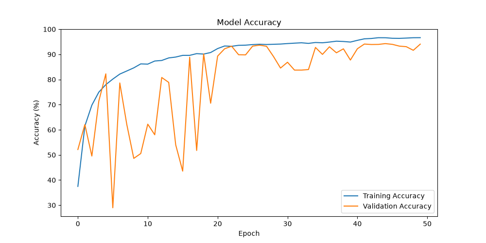
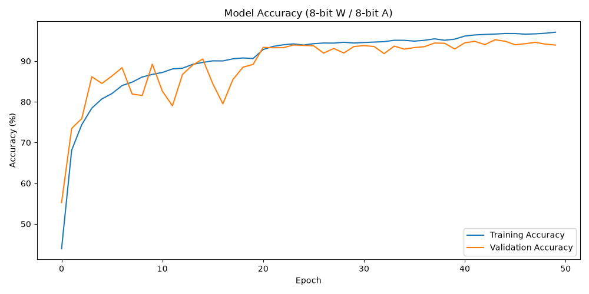
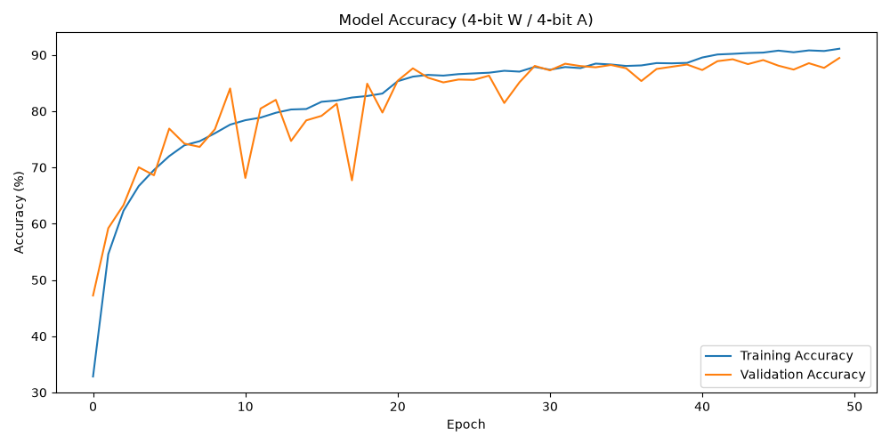
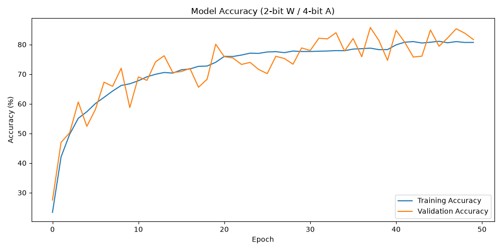
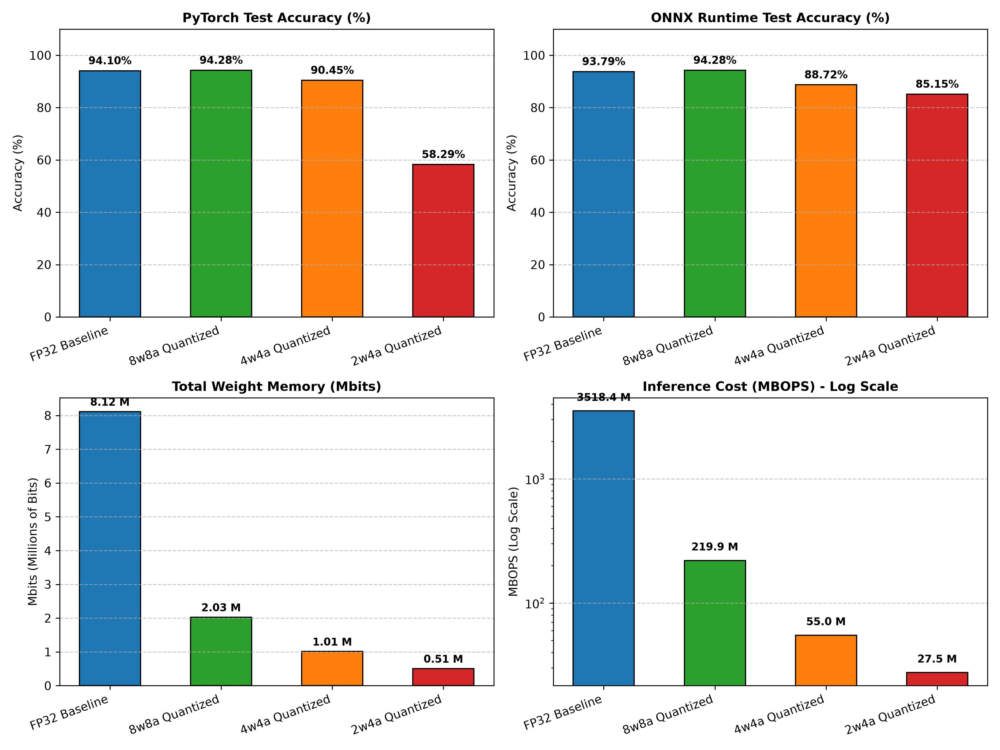
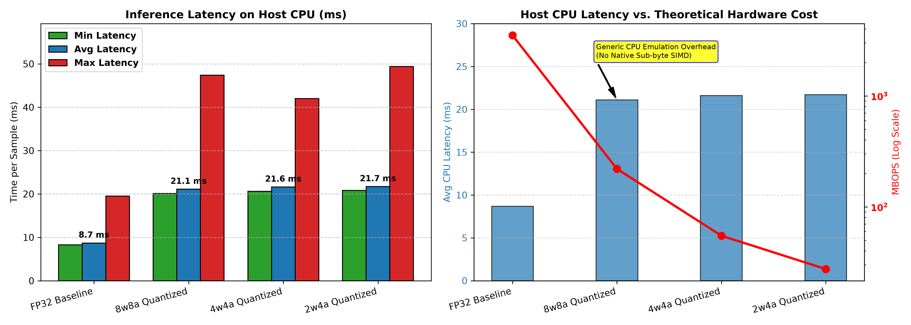

# Task 1 — Quantization-Aware Training: Keyword Spotting

Part of the **Neural Network Acceleration on FPGAs** lab (CDNC, KIT).

This task trains an 11-class keyword-spotting model on the **Google Speech
Commands** dataset in full precision, then repeats training under
quantization-aware training (QAT) at three bit-width configurations using
Brevitas, to evaluate the accuracy/compute trade-off ahead of later
FPGA deployment (Task 4).

## PC Specifications

| Spec | Value |
|---|---|
| CPU | Intel Core i5-10500 @ 3.10GHz (6C/12T) |
| RAM | 16 GB (15 GiB usable) |
| Swap | 2.0 GiB |
| PyTorch CPU threads | 6 |
| ONNX Runtime threads | 12 |

## Repository Structure

```
task1/
├── code/
│   ├── data/
│   │   ├── kws_train_X.npy / kws_train_Y.npy
│   │   └── kws_test_X.npy  / kws_test_Y.npy
│   ├── model_float32.py          # FP32 baseline model definition
│   ├── model_quant.py            # Brevitas QAT model definition + eval entrypoint
│   ├── losses.py
│   ├── speechcommands_dataset.py # Google Speech Commands dataset loader
│   └── test.py                   # QONNX/ONNX Runtime evaluation script
├── dump/                         # scratch / intermediate run artifacts
├── results/
│   ├── model_comparison.csv
│   ├── my_kws_model_accuracy_plot.png   # FP32 training curve
│   ├── my_kws_8w8a_accuracy_plot.png
│   ├── my_kws_4w4a_accuracy_plot.png
│   ├── my_kws_2w4a_accuracy_plot.png
│   ├── Accuracy_InferenceCost_plot.png
│   └── inference_times_plot.png
└── README.md
```

## Model Architecture

A 3-layer CNN (32 → 64 → 64 channels, 3×3 kernels, BatchNorm + ReLU +
MaxPool after the first two conv blocks) followed by two fully-connected
layers (128 → 11 classes). Input is a 10×49 spectrogram.

The same backbone is reused for every quantized variant, with
`QuantConv2d` / `QuantLinear` / `QuantReLU` / `QuantIdentity` (Brevitas)
substituted in for QAT — architecture is held constant across all runs so
that the comparison below isolates the effect of bit-width alone.

## Usage

```bash
# Train the FP32 baseline
python code/model_float32.py

# Train a quantized variant (weight/activation bit-width set inside the script)
python code/model_quant.py

# Evaluate a trained checkpoint (PyTorch + QONNX/ONNX Runtime paths)
python code/test.py
```

> Data is loaded from `code/data/*.npy` (pre-processed Speech Commands
> splits). Adjust script-level config for bit-width / checkpoint paths as
> needed — see each file for available flags.

## Results

### 1. FP32 Baseline

| Metric | Value |
|---|---|
| Model size | 0.98 MB |
| Training time | 21.23 min |
| Validation accuracy | 94.27% |
| Test accuracy | 94.10% (PyTorch) / 93.79% (ONNX Runtime) |
| Total BOPS | 3,518,437,376 |
| Total weight bits | 8,115,200 |
| Avg. / Min. / Max. latency | 8.7 ms / 8.3 ms / 19.5 ms |

### 2. QAT Sweep

Three configurations evaluated (weight bits / activation bits) — all
exceed the 80% accuracy requirement:

| Config | Model size | Training time | Val. acc. | Test acc. (PyTorch) | Test acc. (ONNX RT) | BOPS | Weight bits |
|---|---|---|---|---|---|---|---|
| **8w8a** | 1.02 MB | 38.75 min | 95.24% | 94.28% | 94.28% | 219,885,568 | 2,028,800 |
| 4w4a | 1.02 MB | 39.00 min | 89.46% | 90.45% | 88.72% | 54,971,392 | 1,014,400 |
| 2w4a | 1.02 MB | 38.82 min | 85.75% | 85.15%¹ | 85.15% | 27,485,696 | 507,200 |

¹ PyTorch-side script initially reported **58.29%** for this
configuration — see [Investigation](#investigation-2w4a-pytorchqonnx-accuracy-discrepancy)
below; this was an evaluation-script bug, not a real accuracy drop.

Accuracy degrades gracefully from FP32 down to 4w4a, then further at 2w4a
— consistent with the shrinking number of representable weight levels
(2 bits → only 4 discrete states). 4w4a slightly underperforms 8w8a
relative to its bit-width, consistent with training instability
increasing as available weight levels shrink.

**Best model (by accuracy): 8w8a** — 94.28% test accuracy, matching the
FP32 baseline while using **~16× fewer BOPS** and **~4× fewer weight
bits**.

### Training Curves

| FP32 Baseline | 8w8a |
|---|---|
|  |  |

| 4w4a | 2w4a |
|---|---|
|  |  |

All four runs show validation accuracy tracking training accuracy
closely, with no significant overfitting.

### Accuracy & Inference Cost Overview



Top row: PyTorch vs. ONNX Runtime test accuracy per configuration — note
the PyTorch-side 58.29% outlier at 2w4a discussed below, absent from the
ONNX Runtime measurement. Bottom row: total weight memory and inference
cost (MBOPS, log scale) both shrink sharply with bit-width, from 8.12 M
weight-bits / 3518.4 M BOPS (FP32) down to 0.51 M weight-bits / 27.5 M
BOPS (2w4a).

### Inference Latency



CPU latency (left) *increases* from FP32 to every quantized variant
despite the large drop in theoretical compute cost (right) — discussed
below.

## Investigation: 2w4a PyTorch/QONNX Accuracy Discrepancy

**Symptom:** the official evaluation scripts reported 58.29% (PyTorch,
`model_quant.py`) vs. 85.15% (ONNX Runtime, `test.py`) test accuracy for
the *same* 2w4a checkpoint — visible as the anomalous red bar in the
top-left panel above. This 26.9-point gap is present only at this
bit-width; FP32/8w8a/4w4a matched within ~0–1.7 points across both
evaluation paths.

**Hypotheses tested and ruled out:**
- *Small/non-representative sample count* — ruled out; the official run
  used the full test set (`--samples -1`).
- *Preprocessing mismatch* (`ToTensor()` vs. manual `/255`) — ruled out;
  input data is `uint8`, and both paths correctly rescale to `[0,1]`.
- *Batch-size effects on BatchNorm* — ruled out; `model.eval()` uses
  fixed running statistics, independent of batch size.
- *Fake-quantization numerical noise vs. deterministic QONNX thresholds*
  — ruled out directly: a from-scratch script re-running the checkpoint
  through both the PyTorch model and the exported QONNX graph on the
  **full 10,083-sample test set** gave **85.15% for both paths, with
  100% sample-by-sample prediction agreement**. The two computation
  paths are functionally identical.

**Root cause:** since the model computation itself is provably
consistent between PyTorch and QONNX, and 85.15% is confirmed as the
model's true test accuracy, the 58.29% figure was an artifact of
`model_quant.py`'s specific test branch (e.g. a batching/loader-level
issue) — not a quantization, export, or numerical-precision effect.
Notably, 58.29% falls *below* the 62.56% majority-class baseline, a
result gradual numerical noise cannot produce, but a data/label-handling
bug can.

**Conclusion:** the true 2w4a test accuracy is **85.15%**, matching
validation accuracy (85.75%) and the ONNX Runtime measurement. This
figure is used throughout the comparison above.

## Discussion: BOPS/Weight-Bits vs. Latency Mismatch

BOPS drop by **~130×** (FP32 → 2w4a) while measured CPU latency
*increases* by roughly 2.5×. This is not a hardware-precision effect
(e.g. AVX2/FMA favoring FP32 arithmetic) — `test.py`'s `execute_onnx` is
a **functional simulator**, evaluating each ONNX node (including custom
ops like `MultiThreshold`) via unoptimized, per-sample, per-node Python
execution rather than a vectorized/compiled runtime. That per-call
interpreter overhead dominates regardless of underlying arithmetic
complexity, so BOPS reduction doesn't translate into measured latency
here — as the right-hand chart's own annotation puts it, this is
*"generic CPU emulation overhead (no native sub-byte SIMD)"*.
Packing/unpacking overhead for sub-byte values compounds this further.

Real latency/power benefits from the BOPS reduction only materialize
once the quantized graph is compiled to a dedicated low-bit hardware
datapath (e.g. via FINN, targeting an FPGA), which is the actual target
platform these models are optimized for — not general-purpose x86
software execution (see Task 4).

A secondary factor: the FP32 baseline likely benefits from operator
fusion and library optimization on CPU — Intel MKL/oneDNN fusing
convolution, batch normalization, and ReLU into single cache-optimized
micro-kernels, an optimization path not available to the same extent for
the quantized/fake-quant execution graph.

## Summary

**8w8a** offers the best overall trade-off among the tested
configurations: it matches or slightly exceeds FP32 accuracy (94.28% vs.
93.79%) while cutting BOPS by ~16× and weight bits by ~4×, at acceptable
cost given the target deployment is hardware acceleration rather than
the CPU-based functional simulator used for these latency measurements.